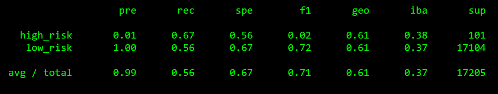

# Credit_Risk_Analysis
ML Learning Pathway Section 17 Challenge

## Overview

It's always been in banks' best interests to be able to identify who they should and shouldn't lend money to.  Having access to a large amount of data means tools like machine learning should be brought to bear to better identify credit risks.  The data being analyzed poses a number of unique challenges.  A particular challenge is that most of the data describes "low-risk" customers, within our particular dataset, around 0.5%.  This means that a model that assumes all customers are "low-risk" would be 99.5% accurate.  This is especially problematic because identifying the "high-risk" customers is of critical importance to the model.  Therefore experimentation should be performed to discover the optimal model and sampling techniques for our dataset.

The Models/Sampling methods were as follows:

* Logistic Regression/Naive Random Oversampling
* Logistic Regression/SMOTE Oversampling
* Logistic Regression/Cluster Centroids Undersampling
* Logistic Regression/Combination Over and Undersampling
* Balanced Random Forest Classifier
* Easy Ensemble AdaBoost Classifier

## Results

The classification reports demonstrate the efficacy of each technique.

* Logistic Regression/Naive Random Oversampling

  ​	Balanced Accuracy: 0.65	

* Logistic Regression/SMOTE Oversampling

  ​	Balanced Accuracy: 0.66	

* Logistic Regression/Cluster Centroids Undersampling

  ​	Balanced Accuracy: 0.53

* Logistic Regression/Combination Over and Undersampling

  ​	Balanced Accuracy: 0.61

  

* Balanced Random Forest Classifier

  ​	Balanced Accuracy: 0.79	

* Easy Ensemble AdaBoost Classifier

  ​	Balanced Accuracy: 0.93	

## Summary

Using different resampling techniques with Logistic Regressions didn't produce much better results.  Oversampling, Undersampling, or a combination of the two only produced a Balanced Accuracy around 60%.  Using the Balanced Random Forest Classifier and the Easy Ensemble AdaBoost Classifier significantly increased Balanced Accuracy to 80% and 93%.  Most importantly, the Easy Ensemble AdaBoost Classifier had the highest Precision and Recall for "high-risk" customers, making it the best model to go with.